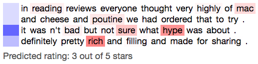

# HNATT
This is a Keras implementation of the **H**ierarchical **N**etwork with **Att**ention architecture [(Yang et al, 2016)](http://www.cs.cmu.edu/~./hovy/papers/16HLT-hierarchical-attention-networks.pdf), and comes with a webapp for easily interacting with the trained models.



### Overview
HNATT is a deep neural network for document classification. It learns hierarchical hidden representations of documents at word, sentence, and document levels. At both the word and sentence levels, HNATT makes use of an attention mechanism, in which it learns a context vector that determines a relevance weighting for its learned encoding of words and sentences. This model has been shown to outperform hierarchical models without attention, indicating that learning an input-dependent weighting across the various substructures of the document leads to improved performance in classification tasks.

### Contents
| Module | Description |
| ------ | ------ |
| `hnatt.py`* | Main HNATT implementation with custom Attention layer. |
| `util.yelp.py` | Data loader for Yelp review data used for training and testing. |
| `util.text_util.py` | Utility function for normalizing review texts. |
| `util.glove.py` | Utility function for loading GloVe embedding weights from a file. You can download the embeddings [here](http://nlp.stanford.edu/data/glove.6B.zip). |
| `main.py` | Demo that trains HNATT on a subset of Yelp reviews and displays attention activation maps at both sentence and word levels on an example review. |
| `app/` | A simple Flask app for exploring a trained HNATT, allowing you to easily make predictions based on a text input and visualize the resulting attention activations at both word and sentence levels. |

*A TensorFlow backend is assumed by the Attention layer.

### Get started
Install dependencies in a new virtual environement via
```bash
virtualenv .venv
source .venv/bin/activate
pip install -r requirements.txt
```

Download the latest Yelp dataset from  https://www.kaggle.com/yelp-dataset/yelp-dataset and move the unzipped folder to `data/yelp-dataset` in the project directory.

Give it a spin.
```bash
python main.py
```

### Train your model
First, load `n` reviews from yelp for training, with 90/10 training/test split:
```python
import util.yelp as yelp
(train_x, train_y), (test_x, test_y) = yelp.load_data(path=YELP_DATA_PATH, size=1e5, train_ratio=0.9)
```
You can also choose to polarize the Yelp ratings into binary labels, corresponding to negative and positive sentiments, by passing in an optional argument, `binary=true`. 

Now you're ready to train your model:
```python
from hnatt import HNATT
h = HNATT()	
h.train(train_x, train_y, 
	batch_size=16,
	epochs=16,
	embeddings_path=EMBEDDINGS_PATH, 
	saved_model_dir=SAVED_MODEL_DIR,
	saved_model_filename=SAVED_MODEL_FILENAME)
```
You can print out sentence and word-level attention activations like so:
```python
activation_maps = h.activation_maps('loved it! will definitely go back again.')
print(activation_maps)
```
### Performance
When trained on random samples of 10,000 Yelp reviews, loaded with `binary=true` and balanced classes in training and test sets, this implementation of HNATT reaches 100% accuracy on the test set, and consistently around 90% accuracy on the validation set.

### Visualizing attention
Once you train an HNATT model and save it locally using the `saved_model_dir` and `saved_model_filename` arguments to `train`, you can easily play with the saved model in an interactive web app by running the following:
```python
python run_hnatt_viewer.py
```
You can then visit `localhost:5000` to interact with your HNATT.
